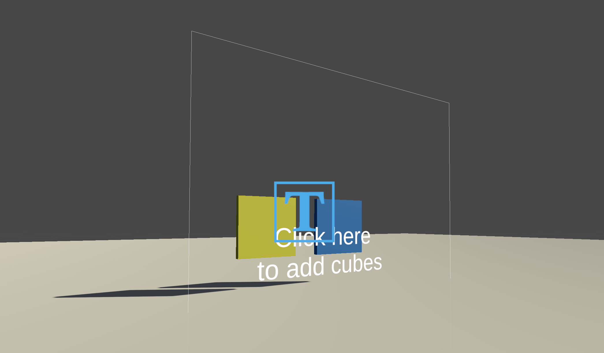
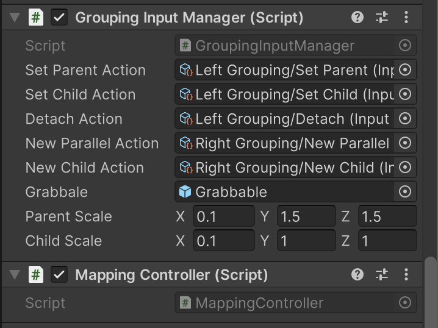
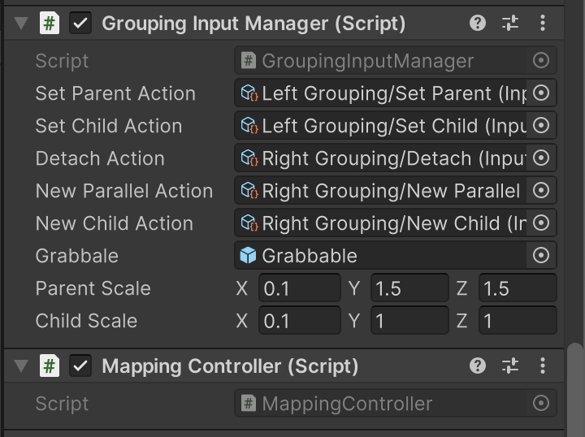
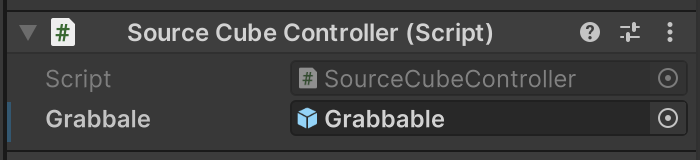
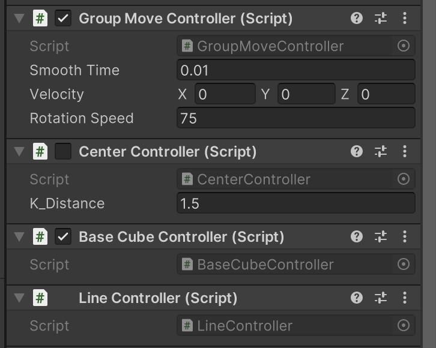

# XRC Students su2023-in03-chen

## Overview
XRC Students su2023-in03-chen is a 3D interaction package for graph traversal. 
Application includes post-it notes organization during Brainstorming, Mind Mapping, and Grouping categories etc.

## Package contents	
Runtime
- BaseCubeController: The basic unit of grouping interaction - cube. Default is active.
- CenterController: The properties of the parent cube. Default is inactive. It only turns active when triggered by certain grouping input actions.
- LineController: The visualization of potential grouping relationship between two cubes.

- GroupingInputManager: Custom grouping action interaction
- MappingController: If you're pulling a cube towards the main camera, map the controller position to certain world position by applying a log transformation

- IRotateTowards: Update the cube so that it always rotates towards the main camera
- ISmoothDamp: Smooth the child cube position towards the parent cube position

- SourceCubeController: Properties of the origin of cubes

Samples
- Prefabs: Carefully designed cubes for setting parent-child relationship 
- Scenes: MindMapSample
- Input: Custom grouping action asset
- Materials: Cube materials

## Installation instructions
Before you install this package, you would need to install edu.cornell.xrc.core. 

1. In the Unity Editor, click on Window > Package Manager
2. Click the + button and choose Add package from git URL option
3. Paste this URL https://github.com/xrc-students/xrc-students-su2023-in03-chen.git in the prompt and click on Add
4. You might have to authenticate as this is a private repository
5. The package should be installed into your project
6. You can download Playback Samples from under Samples

## Requirements	
Unity Editor 2021.3 and later

## Dependencies
XRC Students su2023-in03-chen package has the following dependencies which are automatically added to your project when installing:

- Input System (com.unity.inputsystem)
- XR Interaction Toolkit (com.unity.xr.interaction.toolkit)
- TextMeshPro (com.unity.textmeshpro)

## Limitations	
1. The grouping scripts rely on the prefab structure, which a renderer is nested inside a grab interactable with a transform of (1,1,1). Therefore, when rendering the material, I called GetChild(0) to reference the renderer and get certain color. 
2. Cubes created might be more than you need. This is because the hover detection on the source cube is very sensitive, and you may accidentally hover multiple times and create more cubes than you need.

## Reference
# Grouping Action Asset
| **Action Name** | **Action Mapping**                  |
|-----------------|-------------------------------------|
| Set Parent      | Primary Button (Left Controller)    |
| Set Child       | Secondary Button (Left Controller)  |
| New Parallel    | Primary Button (Right Controller)   |
| New Child       | Secondary Button (Right Controller) |

## Samples
You can find the demo scene at /Samples/MindMapSample/Scenes/MindMap

Demo video: https://drive.google.com/file/d/18NbxN3piY0wWsp219lNZOgXSnkZPodgW/view?usp=sharing

## Tutorials

Attach the Grouping Input Manager and Mapping Controller to both left and right controllers.
Then drag in the input action references as shown.

Left Hand Controller:

Right Hand Controller:

Create a source cube using the SourceCube Prefab
Then attach the Grabbable Prefab as shown.

Create a cube using the Grabbale Prefab and DISABLE it in the scene.
Then attach the Group Move Controller, Center Controller, and Base Cube Controller, and Line Controller as shown.
Make sure the DISABLE the Center Controller, and enable all the rest.

## Workflows	
1. Hover the controller on the source cube to creat a cube. 
Repeat the hover to creat another cube.
2. Move the two cubes close to each other, so that there is a green line in between.
This indicates that there are potential grouping relationships.
3. While selecting one cube, press the Primary Button on the Left Controller, so that it becomes the parent, 
and the other cube becomes the child.
4. Hover the controller on the source cube to creat another cube.
Move it close to the parent cube. While selecting this cube, 
press the Secondary Button on the Left Controller, so that it becomes a child of the parent cube.
5. While selecting a child cube, press the Primary Button on the Right Controller. 
This action creates a cube on the same layer as the selected cube
6. While selecting a child cube, press the Secondary Button on the Right Controller
This action Create a child of the selected cube.
7. Select any of the cube and press the Trigger on either controller.
This action detaches the selected cube from its parent
If the selected cube is a parent, this action detaches all its children cubes

## Advanced topics
This package provides functions to establish parent-child relationship among game objects.
Application includes post-it notes organization during Brainstorming, Mind Mapping, and Grouping categories etc.